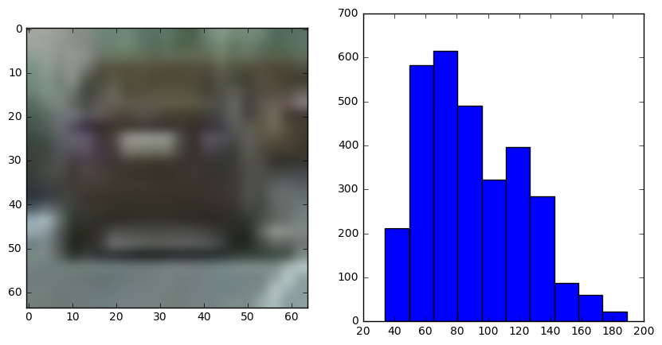
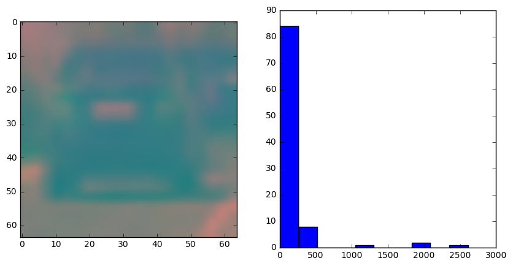
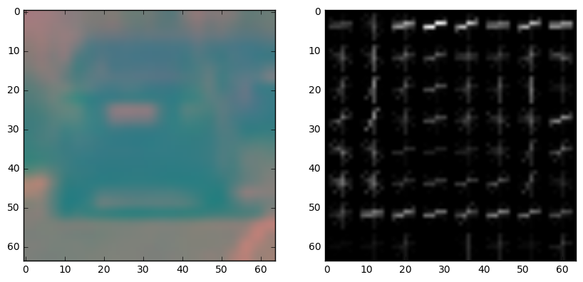
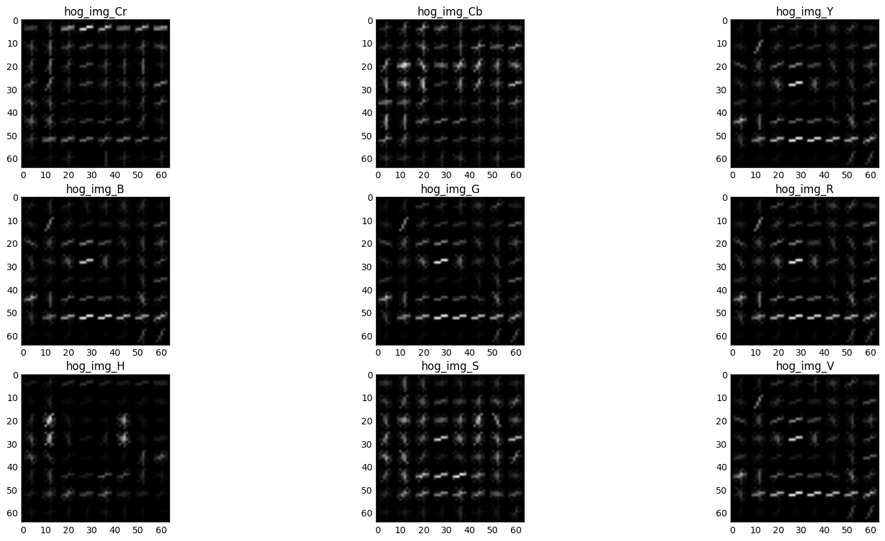
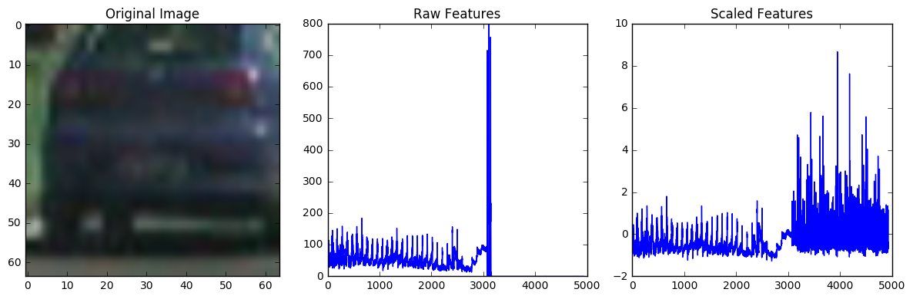
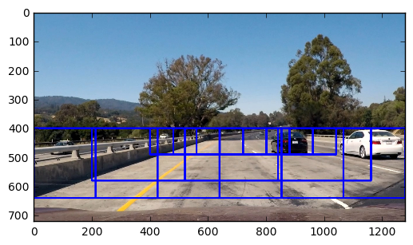
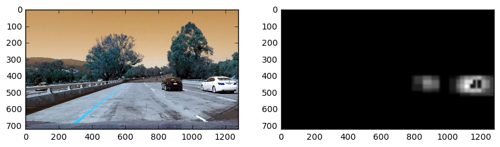
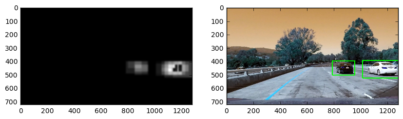
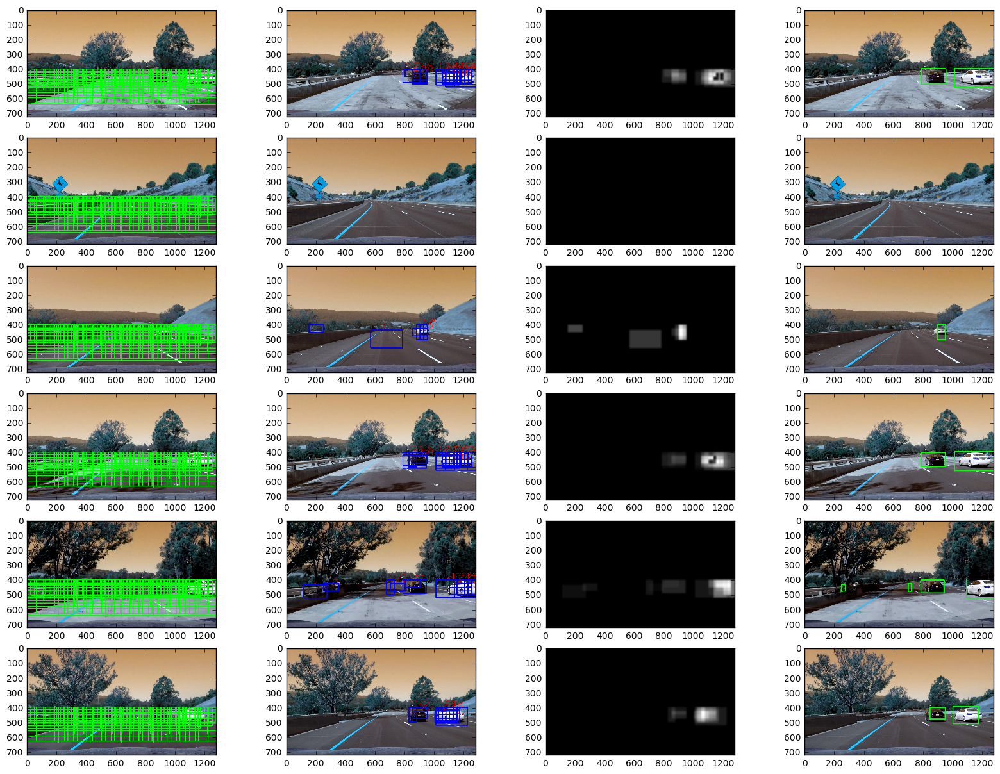

```python
# import packages
from skimage import io
import glob
import matplotlib.pyplot as plt
import matplotlib.image as mpimg
import numpy as np
%matplotlib inline
import cv2
from skimage.feature import hog
from sklearn.preprocessing import StandardScaler
from scipy.sparse import vstack
```

# Data Preprocessing


```python
# all given pictures of non-vehicles and vehicles from the repository
non_vehicle_list = glob.glob('non-vehicles/*/*.png')
vehicle_list = glob.glob('vehicles/*/*.png')

# creating labels for the classification
label_ones = np.ones(len(vehicle_list), dtype=np.int)
label_zeros = np.zeros(len(non_vehicle_list), dtype=np.int)
```

#### 1. Spatial Binning


```python
# Converts an image into a color space, resizes it and extract the color values for each channel

# in case no color conversion is necessary, just don't pass a color_space parameter
def bin_spatial(img, color_space='BGR', size=(32, 32)):
    # Convert image to new color space if different then RGB
    if color_space != 'BGR':
        exec('img = cv2.cvtColor(img, cv2.COLOR_BGR2'+color_space+')')
    resized = cv2.resize(img, size)
    features = resized.ravel()
    return features

fig= plt.figure(figsize=(10,5))

test_img = cv2.imread(vehicle_list[0])
plt.subplot(121)
plt.imshow(test_img)

spatial_img = bin_spatial(test_img, color_space='YCrCb')
plt.subplot(122)
plt.hist(spatial_img)

```


    (array([ 211.,  582.,  615.,  490.,  322.,  396.,  285.,   88.,   61.,   22.]),
     array([  34. ,   49.5,   65. ,   80.5,   96. ,  111.5,  127. ,  142.5,
             158. ,  173.5,  189. ]),
     <a list of 10 Patch objects>)





#### 2. Color Histogram


```python
# Color Histogram creates a histogram of all color channels from the given image
def color_hist(img, nbins=32, bins_range=(0,256)):
    # Compute a histogram of the different color channels
    channel1_hist = np.histogram(img[:,:,0], bins=nbins, range=bins_range)
    channel2_hist = np.histogram(img[:,:,1], bins=nbins, range=bins_range)
    channel3_hist = np.histogram(img[:,:,2], bins=nbins, range=bins_range)
    # Concatenate the histograms into a single feature vector
    hist_features = np.concatenate((channel1_hist[0], channel2_hist[0], channel3_hist[0]))
    return hist_features

fig= plt.figure(figsize=(10,5))

test_img = cv2.imread(vehicle_list[0])
test_img = cv2.cvtColor(test_img, cv2.COLOR_BGR2YCrCb)
plt.subplot(121)
plt.imshow(test_img)

color_hist_ = color_hist(test_img)
plt.subplot(122)
plt.hist(color_hist_)
```


    (array([ 84.,   8.,   0.,   0.,   1.,   0.,   0.,   2.,   0.,   1.]),
     array([    0. ,   261.2,   522.4,   783.6,  1044.8,  1306. ,  1567.2,
             1828.4,  2089.6,  2350.8,  2612. ]),
     <a list of 10 Patch objects>)





#### 3. Hog Features


```python
# getting Histogram of Gradients
def get_hog_features(img, orient, pix_per_cell, cell_per_block, 
                        vis=False, feature_vec=True):
    # Call with two outputs if vis==True
    if vis == True:
        features, hog_image = hog(img, orientations=orient, pixels_per_cell=(pix_per_cell, pix_per_cell),
                                  cells_per_block=(cell_per_block, cell_per_block), transform_sqrt=True, 
                                  visualise=vis, feature_vector=feature_vec)
        return features, hog_image
    # Otherwise call with one output. (way faster for just data preprocessing)
    else:      
        features = hog(img, orientations=orient, pixels_per_cell=(pix_per_cell, pix_per_cell),
                       cells_per_block=(cell_per_block, cell_per_block), transform_sqrt=True, 
                       visualise=vis, feature_vector=feature_vec)
        return features
    
fig= plt.figure(figsize=(10,5))

test_img = cv2.imread(vehicle_list[0])
test_img = cv2.cvtColor(test_img, cv2.COLOR_BGR2YCrCb)
plt.subplot(121)
plt.imshow(test_img)

get_hog_features_, hog_img = get_hog_features(test_img[:,:,2],orient=9, pix_per_cell=8, cell_per_block=2, vis = True)

plt.subplot(122)
plt.imshow(hog_img, 'gray')
```


    <matplotlib.image.AxesImage at 0x27fa166a160>





#### Different Hog Features shown


```python
test_img = cv2.imread(vehicle_list[0])
test_img = cv2.cvtColor(test_img, cv2.COLOR_BGR2YCrCb)

_, hog_img_Cr = get_hog_features(test_img[:,:,2],orient=9, pix_per_cell=8, cell_per_block=2, vis = True)
_, hog_img_Cb = get_hog_features(test_img[:,:,1],orient=9, pix_per_cell=8, cell_per_block=2, vis = True)
_, hog_img_Y = get_hog_features(test_img[:,:,0],orient=9, pix_per_cell=8, cell_per_block=2, vis = True)


test_img = cv2.cvtColor(test_img, cv2.COLOR_YCrCb2RGB)

_, hog_img_B = get_hog_features(test_img[:,:,2],orient=9, pix_per_cell=8, cell_per_block=2, vis = True)
_, hog_img_G = get_hog_features(test_img[:,:,1],orient=9, pix_per_cell=8, cell_per_block=2, vis = True)
_, hog_img_R = get_hog_features(test_img[:,:,0],orient=9, pix_per_cell=8, cell_per_block=2, vis = True)

test_img = cv2.cvtColor(test_img, cv2.COLOR_RGB2HSV)

_, hog_img_V = get_hog_features(test_img[:,:,2],orient=9, pix_per_cell=8, cell_per_block=2, vis = True)
_, hog_img_S = get_hog_features(test_img[:,:,1],orient=9, pix_per_cell=8, cell_per_block=2, vis = True)
_, hog_img_H = get_hog_features(test_img[:,:,0],orient=9, pix_per_cell=8, cell_per_block=2, vis = True)


fig= plt.figure(figsize=(20,10))

plt.subplot(331)
plt.imshow(hog_img_Cr, 'gray')
plt.title('hog_img_Cr')


plt.subplot(332)
plt.imshow(hog_img_Cb, 'gray')
plt.title('hog_img_Cb')

plt.subplot(333)
plt.imshow(hog_img_Y, 'gray')
plt.title('hog_img_Y')

plt.subplot(334)
plt.imshow(hog_img_B, 'gray')
plt.title('hog_img_B')

plt.subplot(335)
plt.imshow(hog_img_G, 'gray')
plt.title('hog_img_G')

plt.subplot(336)
plt.imshow(hog_img_R, 'gray')
plt.title('hog_img_R')

plt.subplot(337)
plt.imshow(hog_img_H, 'gray')
plt.title('hog_img_H')

plt.subplot(338)
plt.imshow(hog_img_S, 'gray')
plt.title('hog_img_S')

plt.subplot(339)
plt.imshow(hog_img_V, 'gray')
plt.title('hog_img_V')
```


    <matplotlib.text.Text at 0x2809245d7f0>





### Functions For image Preprocessing Summary and executable


```python
def bin_spatial(img, color_space='RGB', size=(32, 32)):
    # Convert image to new color space if different then RGB
    if color_space != 'RGB':
        exec('img = cv2.cvtColor(img, cv2.COLOR_RGB2'+color_space+')')
    resized = cv2.resize(img, size)
    features = resized.ravel()
    return features

def color_hist(img, nbins=32, bins_range=(0,256)):
    # Compute a histogram of the different color channels
    channel1_hist = np.histogram(img[:,:,0], bins=nbins, range=bins_range)
    channel2_hist = np.histogram(img[:,:,1], bins=nbins, range=bins_range)
    channel3_hist = np.histogram(img[:,:,2], bins=nbins, range=bins_range)
    # Concatenate the histograms into a single feature vector
    hist_features = np.concatenate((channel1_hist[0], channel2_hist[0], channel3_hist[0]))
    return hist_features

def get_hog_features(img, orient, pix_per_cell, cell_per_block, 
                        vis=False, feature_vec=True):
    # Call with two outputs if vis==True
    if vis == True:
        features, hog_image = hog(img, orientations=orient, pixels_per_cell=(pix_per_cell, pix_per_cell),
                                  cells_per_block=(cell_per_block, cell_per_block), transform_sqrt=True, 
                                  visualise=vis, feature_vector=feature_vec)
        return features, hog_image
    # Otherwise call with one output. (way faster for just data preprocessing)
    else:      
        features = hog(img, orientations=orient, pixels_per_cell=(pix_per_cell, pix_per_cell),
                       cells_per_block=(cell_per_block, cell_per_block), transform_sqrt=True, 
                       visualise=vis, feature_vector=feature_vec)
        return features


def extract_features(imgs, cspace='RGB', spatial_size=(32, 32),
                        hist_bins=32, hist_range=(0, 256), orient=9, 
                        pix_per_cell=8, cell_per_block=2, hog_channel=0):
    # Create a list to append feature vectors to
    features = []
    # Iterate through the list of images
    for img in imgs:
        # Read in each one by one
        img = cv2.imread(img)
        # apply color conversion if other than 'BGR' cv2 reads images as BGR
        if cspace != 'BGR':
            exec('img = cv2.cvtColor(img, cv2.COLOR_BGR2'+cspace+')')
        # Apply bin_spatial()  to get spatial color features
        spatial_ = bin_spatial(img)
        # Apply color_hist() to get color histogram features
        color_hist_ = color_hist(img)
        # I take an orientation of 9, 8 pixels per block with 2 cells per block.
        # given the size of the image (64,64) this is a reasonable allocation between computation power and image size
        # just to keep the returning feature size in mind: 7*7*2*2*9 = 1764 features!
        hog_features = get_hog_features(img[:,:,hog_channel], orient, 
                        pix_per_cell, cell_per_block, vis=False, feature_vec=True)
        features.append(np.concatenate((spatial_, color_hist_, hog_features)))
    return features
```


```python
# Get feature list from the list of image path
channel_ = 2 # Extact the blue-difference and red-difference chroma components (YCrCb chosen in cspace) 

vehicle_features = extract_features(vehicle_list, cspace='YCrCb', spatial_size=(32, 32),
                        hist_bins=16, hist_range=(0, 256), hog_channel=channel_)
non_vehicle = extract_features(non_vehicle_list, cspace='YCrCb', spatial_size=(32, 32),
                        hist_bins=16, hist_range=(0, 256), hog_channel=channel_)
```

#### 4. Feature Normalization


```python
# define y 
y = np.concatenate((label_ones,label_zeros)) 
# Create an array stack of feature vectors
X = np.vstack([vehicle_features, non_vehicle]).astype(np.float64)                
# per column scaler
X_scaler = StandardScaler().fit(X)
# Transform the scaler to X
scaled_X = X_scaler.transform(X)
index = np.random.randint(0, 1000)
# Plot Results
fig = plt.figure(figsize=(12,4))
plt.subplot(131)
plt.imshow(mpimg.imread(vehicle_list[index]))
plt.title('Original Image')
plt.subplot(132)
plt.plot(X[index])
plt.title('Raw Features')
plt.subplot(133)
plt.plot(scaled_X[index])
plt.title('Scaled Features')
fig.tight_layout()
```





# Fitting a Classifier

#### 1. Splitting into Training and Test Dataset


```python
from sklearn.cross_validation import train_test_split

X_train, X_test, y_train, y_test = train_test_split(
    scaled_X, y, test_size=0.2, random_state=42)
```

#### 2. Applying Linear Classifier and Show Accuracy


```python
from sklearn.svm import LinearSVC

svc = LinearSVC()
svc.fit(X_train, y_train)

print('Train Accuracy of SVC = ', svc.score(X_train, y_train))
print('Test Accuracy of SVC = ', svc.score(X_test, y_test))
```

    Train Accuracy of SVC =  1.0
    Test Accuracy of SVC =  0.982123510293
    

# Define a Sliding Window


```python
def draw_boxes(img, bboxes, color=(0, 0, 255), thick=6):
    # Make a copy of the image
    imcopy = np.copy(img)
    # Iterate through the bounding boxes
    for bbox in bboxes:
        # Draw a rectangle given bbox coordinates
        cv2.rectangle(imcopy, bbox[0], bbox[1], color, thick)
    # Return the image copy with boxes drawn
    return imcopy

def slide_window(img, x_start_stop=[None, None], y_start_stop=[None, None], 
                    xy_window=(64, 64), xy_overlap=(0.5, 0.5)):
    # 
    # If x and/or y start/stop positions not defined, set to image size
    if x_start_stop[0] == None:
        x_start_stop[0] = 0
    if x_start_stop[1] == None:
        x_start_stop[1] = img.shape[1]
    if y_start_stop[0] == None:
        y_start_stop[0] = 0
    if y_start_stop[1] == None:
        y_start_stop[1] = img.shape[0]
    # span of the region to be searched    
    xspan = x_start_stop[1] - x_start_stop[0]
    yspan = y_start_stop[1] - y_start_stop[0]
    # number of pixels per step in x/y
    nx_pix_per_step = np.int(xy_window[0]*(1 - xy_overlap[0]))
    ny_pix_per_step = np.int(xy_window[1]*(1 - xy_overlap[1]))
    # number of windows in x/y
    nx_windows = np.int(xspan/nx_pix_per_step) - 1
    ny_windows = np.int(yspan/ny_pix_per_step) - 1
    # Initialize a list to append window positions to
    window_list = []
    # Loop through finding x and y window positions
    for ys in range(ny_windows):
        for xs in range(nx_windows):
            # Calculate window position
            startx = xs*nx_pix_per_step + x_start_stop[0]
            endx = startx + xy_window[0]
            starty = ys*ny_pix_per_step + y_start_stop[0]
            endy = starty + xy_window[1]
            # Append window position to list
            window_list.append(((startx, starty), (endx, endy)))
    # Return the list of windows
    return window_list
```

#### Example for sliding Window Function


```python
image = cv2.imread('test_images/test1.jpg')
image = cv2.cvtColor(image, cv2.COLOR_BGR2RGB)

x_size, y_size = image.shape[1], image.shape[0]
print(x_size)
overlap_small = (0.5,0)
overlap_mid = (0,0)
overlap_large = (.5,0)

windows_small = slide_window(image, x_start_stop=[400, 1100], y_start_stop=[400, 600], 
                   xy_window=(x_size//8, y_size//8), xy_overlap=overlap_small)

windows_mid = slide_window(image, x_start_stop=[200, 1600], y_start_stop=[400, 800], 
                    xy_window=(x_size//4, y_size//4), xy_overlap=overlap_mid)


windows_large = slide_window(image, x_start_stop=[None, None], y_start_stop=[400, 900], 
                    xy_window=(x_size//3, y_size//3), xy_overlap=overlap_large)

windows = windows_mid + windows_small + windows_large


window_img = draw_boxes(image, windows, color=(0, 0, 255), thick=6)


plt.imshow(window_img)
```

    1280
    


    <matplotlib.image.AxesImage at 0x280852a1860>





## Finding windows for later detections


```python
# build pipeline to only append frames that detect vehicles
def draw_boxes(img, bboxes, color=(0, 0, 255), thick=6, draw_prob = False):
    # Make a copy of the image
    imcopy = np.copy(img)
    # Iterate through the bounding boxes
    for bbox in bboxes:
        cv2.putText(imcopy,str(round(bbox[1][0],2)), bbox[0][0], cv2.FONT_HERSHEY_SIMPLEX, 2, 255) if draw_prob else None
        cv2.rectangle(imcopy, bbox[0][0], bbox[0][1], color, thick)
    return imcopy

def prepare_to_predict(img, cspace='BGR', spatial_size=(32, 32),
                        hist_bins=32, hist_range=(0, 256), orient=9, 
                        pix_per_cell=8, cell_per_block=2, hog_channel=channel_):
    # Create a list to append feature vectors to
    features = []
    # Iterate through the list of images
    # apply color conversion if other than 'BGR'
    if cspace != 'BGR':
        exec('img = cv2.cvtColor(img, cv2.COLOR_BGR2'+cspace+')')
    # Apply bin_spatial() to get spatial color features
    spatial_ = bin_spatial(img)
    # Apply color_hist() to get color histogram features
    color_hist_ = color_hist(img)
    hog_features = get_hog_features(img[:,:,0], orient, 
                    pix_per_cell, cell_per_block, vis=False, feature_vec=True)
    features.append(np.concatenate((spatial_, color_hist_, hog_features)))
    scaled_features = X_scaler.transform(features)
    return scaled_features

def get_coords_to_search(image):
    x_size, y_size = image.shape[1], image.shape[0]
    
    overlap_small = (0.7,.7)
    overlap_mid = (0.8,.7)
    overlap_large = (.5,.5)
    overlap_medium = (0.6,0.6)

    windows_small = slide_window(image, x_start_stop=[None, None], y_start_stop=[400, 500], 
                        xy_window=(x_size//8, y_size//8), xy_overlap=overlap_small)

    windows_mid = slide_window(image, x_start_stop=[None, None], y_start_stop=[400, 600], 
                        xy_window=(x_size//6, y_size//6), xy_overlap=overlap_mid)

    windows_medium = slide_window(image, x_start_stop=[None, None], y_start_stop=[400, 600], 
                        xy_window=(x_size//4, y_size//4), xy_overlap=overlap_medium)

    windows_large = slide_window(image, x_start_stop=[None, None], y_start_stop=[400, 720], 
                        xy_window=(x_size//3, y_size//3), xy_overlap=overlap_large)
    
    windows = windows_small + windows_mid + windows_large + windows_medium

    return windows

f, (
    (ax1_sliding, ax1_img), (ax2_sliding, ax2_img), (ax3_sliding, ax3_img), (ax4_sliding, ax4_img),
    (ax5_sliding, ax5_img), (ax6_sliding, ax6_img)
   ) = plt.subplots(6,2 , figsize = (20,40))
i = 1

img_files = glob.glob('test_images/*.jpg')
for img in img_files:
    image = cv2.imread(img)
    search = get_coords_to_search(image)
    all_boxes = []
    cars = []
    for bbox in search: 
        patch = image[bbox[0][1]:bbox[1][1],bbox[0][0]:bbox[1][0]]
        patch = cv2.resize(patch, (64,64))
        patch = prepare_to_predict(patch, hog_channel = channel_)
#         pred_ = svc.predict(patch)
        prob_ = svc.decision_function(patch)
    #     print(pred_)
        all_boxes.append((bbox, prob_))
        if prob_ > 0.6:
            cars.append((bbox,prob_))
    all_sliding = draw_boxes(image, all_boxes, color=(0,255,0), thick=4, draw_prob = False)
    window_img = draw_boxes(image, cars, color=(0, 0, 255), thick=6, draw_prob = True)
    exec("ax" + str(i) + "_img.imshow(window_img)")
    exec("ax" + str(i) + "_sliding.imshow(all_sliding)")
    i +=1
```


## Adding Heatmap to the Transformation Process


```python
def draw_heatmap(img, bbox, video= False):
    black_ = np.zeros_like(img)
    black_ = cv2.cvtColor(black_, cv2.COLOR_RGB2GRAY)
    for box in bbox:
        x1 = box[0][0][0]
        x2 = box[0][1][0]
        y1 = box[0][0][1]
        y2 = box[0][1][1]
        prob_ = box[1][0]
        # we increase the area where our prediction was positive by the decision_function * 10 brightness pixels
        # this value was set after some iterations and has proven to be quite stable
        black_[y1:y2+1, x1:x2+1] =  black_[y1:y2+1, x1:x2+1] + (prob_*10)
    # add a Gaussian Blur
    black_ = cv2.GaussianBlur(black_,(31,31),0)
    # for the video we want to have a nice smoove heatmap, to decrease the influence of false positive
    if video and detect.last_frame != []:
        black_ = 0.95*detect.last_frame + 0.05*black_
        black_ = black_.astype(np.uint8)
    detect.last_frame = black_
    return black_

image = cv2.imread('test_images/test1.jpg')
search = get_coords_to_search(image)
all_boxes = []
cars = []
for bbox in search: 
    patch = image[bbox[0][1]:bbox[1][1],bbox[0][0]:bbox[1][0]]
    patch = cv2.resize(patch, (64,64))
    patch = prepare_to_predict(patch, hog_channel = channel_)
    prob_ = svc.decision_function(patch)
    all_boxes.append((bbox, prob_))
    # if the decision function gives us a value above 0.6
    # Found by try and error. 
    # This is just the first part where the decision_function is taken into consideration. We multiply by the decision_function
    # to define the brightness of the pixels in the draw_heatmap function
    if prob_ > 0.6:
        cars.append((bbox,prob_))

fig= plt.figure(figsize=(10,5))

heat_ = draw_heatmap(image, cars, video=False)

plt.subplot(121)
plt.imshow(image)

plt.subplot(122)
plt.imshow(heat_, 'gray')
```


    <matplotlib.image.AxesImage at 0x28088b815c0>





## Finding Contours from the Heatmap


```python
detection = np.copy(image)
# thresholding pixels that have a value below 19 
# (there has to be a very confident prediction or two detections to have trigger a fiding)
ret,thresh = cv2.threshold(heat_,19,255,0)
# finding contours from the heatmap
# This function takes 
# cv2.RETR_EXTERNAL: retrieves only the extreme outer contours
# cv2.CHAIN_APPROX_SIMPLE: compresses horizontal, vertical, and diagonal segments and leaves only their end points. 
# (4 corner points)
_, contours, _ = cv2.findContours(thresh.copy(), cv2.RETR_EXTERNAL ,cv2.CHAIN_APPROX_SIMPLE)
for i in range(len(contours)):
    x,y,w,h = cv2.boundingRect(contours[i])
    detection = cv2.rectangle(detection,(x,y),(x+w,y+h),(0,255,0),6) 
    
fig= plt.figure(figsize=(10,5))

plt.subplot(121)
plt.imshow(heat_, 'gray')

plt.subplot(122)
plt.imshow(detection)
```


    <matplotlib.image.AxesImage at 0x2808cd64a20>





# Final Pipeline showing Transformation


```python
# define Cars Class which saves the last frame matrix 
class Cars():
    def __init__(self):
        self.last_frame = []
```


```python
# build pipeline to only append frames that detect vehicles
def draw_boxes(img, bboxes, color=(0, 0, 255), thick=6, draw_prob = False):
    # Make a copy of the image
    imcopy = np.copy(img)
    # Iterate through the bounding boxes
    for bbox in bboxes:
        cv2.putText(imcopy,str(round(bbox[1][0],2)), bbox[0][0], cv2.FONT_HERSHEY_SIMPLEX, 2, 255) if draw_prob else None
        cv2.rectangle(imcopy, bbox[0][0], bbox[0][1], color, thick)
    return imcopy

def prepare_to_predict(img, cspace='BGR', spatial_size=(32, 32),
                        hist_bins=32, hist_range=(0, 256), orient=9, 
                        pix_per_cell=8, cell_per_block=2, hog_channel=channel_):
    # Create a list to append feature vectors to
    features = []
    # Iterate through the list of images
    # apply color conversion if other than 'RGB'
    if cspace != 'BGR':
        exec('img = cv2.cvtColor(img, cv2.COLOR_BGR2'+cspace+')')
    # Apply bin_spatial() to get spatial color features
    spatial_ = bin_spatial(img)
    # Apply color_hist() to get color histogram features
    color_hist_ = color_hist(img)
    hog_features = get_hog_features(img[:,:,0], orient, 
                    pix_per_cell, cell_per_block, vis=False, feature_vec=True)
    features.append(np.concatenate((spatial_, color_hist_, hog_features)))
    scaled_features = X_scaler.transform(features)
    return scaled_features

def get_coords_to_search(image):
    x_size, y_size = image.shape[1], image.shape[0]
    
    overlap_small = (0.3,.8)
    overlap_mid = (0.7,.7)
    overlap_large = (.5,.5)

    overlap_medium = (0.6,0.6)
    
    windows_small_1 = slide_window(image, x_start_stop=[None, None], y_start_stop=[400, 540], 
                        xy_window=(50, 100), xy_overlap=overlap_large)

    
    windows_small_3 = slide_window(image, x_start_stop=[None, None], y_start_stop=[400, 540], 
                        xy_window=(100, 50), xy_overlap=overlap_large)

    windows_small_2 = slide_window(image, x_start_stop=[None, None], y_start_stop=[400, 500], 
                        xy_window=(x_size//8, y_size//8), xy_overlap=overlap_small)

    windows_mid_2 = slide_window(image, x_start_stop=[None, None], y_start_stop=[400, 600], 
                        xy_window=(x_size//6, y_size//6), xy_overlap=overlap_mid)

    windows_medium = slide_window(image, x_start_stop=[None, None], y_start_stop=[400, 600], 
                        xy_window=(x_size//4, y_size//4), xy_overlap=overlap_medium)

    windows_large = slide_window(image, x_start_stop=[None, None], y_start_stop=[400, 720], 
                        xy_window=(x_size//3, y_size//3), xy_overlap=overlap_large)
    
    windows =windows_small_2 + windows_mid_2 + windows_large + windows_medium + windows_small_3 + windows_small_1
    
    return windows


def draw_heatmap(img, bbox, video= False):
    black_ = np.zeros_like(img)
    black_ = cv2.cvtColor(black_, cv2.COLOR_RGB2GRAY)
    for box in bbox:
        x1 = box[0][0][0]
        x2 = box[0][1][0]
        y1 = box[0][0][1]
        y2 = box[0][1][1]
        prob_ = box[1][0]
        black_[y1:y2+1, x1:x2+1] =  black_[y1:y2+1, x1:x2+1] + (prob_*10)
    # add a Gaussian Blur
    black_ = cv2.GaussianBlur(black_,(31,31),0)
    if video and detect.last_frame != []:
        black_ = 0.95*detect.last_frame + 0.05*black_
        black_ = black_.astype(np.uint8)
    detect.last_frame = black_
    return black_

# Figure for plotting
f, (
    (ax1_img, ax1_sliding, ax1_heat_, ax1_detection),
    (ax2_img, ax2_sliding, ax2_heat_, ax2_detection),
    (ax3_img, ax3_sliding, ax3_heat_, ax3_detection),
    (ax4_img, ax4_sliding, ax4_heat_, ax4_detection),
    (ax5_img, ax5_sliding, ax5_heat_, ax5_detection),
    (ax6_img, ax6_sliding, ax6_heat_, ax6_detection)
    ) = plt.subplots(6,4 , figsize = (20,15))


img_list = glob.glob('test_images/*.jpg')
j = 1
for img_file in img_list:
    image = cv2.imread(img_file)
    search = get_coords_to_search(image)
    all_boxes = []
    cars = []
    for bbox in search: 
        patch = image[bbox[0][1]:bbox[1][1],bbox[0][0]:bbox[1][0]]
        patch = cv2.resize(patch, (64,64))
        patch = prepare_to_predict(patch, hog_channel = channel_)
        prob_ = svc.decision_function(patch)
        all_boxes.append((bbox, prob_))
        if prob_ > 0.6:
            cars.append((bbox,prob_))


    heat_ = draw_heatmap(image, cars, video=False)
    all_sliding = draw_boxes(image, all_boxes, color=(0,255,0), thick=4, draw_prob = False)
    window_img = draw_boxes(image, cars, color=(0, 0, 255), thick=6, draw_prob = True)

    detection = np.copy(image)
    ret,thresh = cv2.threshold(heat_,19,255,0)
    _, contours, _ = cv2.findContours(thresh.copy(), cv2.RETR_EXTERNAL,cv2.CHAIN_APPROX_SIMPLE)
    for i in range(len(contours)):
        x,y,w,h = cv2.boundingRect(contours[i])
        detection = cv2.rectangle(detection,(x,y),(x+w,y+h),(0,255,0),6) 
    
    exec("ax" + str(j) + "_img.imshow(all_sliding)")
    exec("ax" + str(j) + "_sliding.imshow(window_img)")
    exec("ax" + str(j) + "_heat_.imshow(heat_, 'gray')")
    exec("ax" + str(j) + "_detection.imshow(detection)")
    j += 1 
```





```python
detect = Cars()
def video_pipeline(image):
    image = cv2.cvtColor(image, cv2.COLOR_RGB2BGR)
    search = get_coords_to_search(image)
    all_boxes = []
    cars = []
    for bbox in search: 
        patch = image[bbox[0][1]:bbox[1][1],bbox[0][0]:bbox[1][0]]
        patch = cv2.resize(patch, (64,64))
        patch = prepare_to_predict(patch, hog_channel = channel_)
        prob_ = svc.decision_function(patch)
        all_boxes.append((bbox, prob_))
        if prob_ > 0.6:
            cars.append((bbox,prob_))

    heat_ = draw_heatmap(image, cars, video=True)
    all_sliding = draw_boxes(image, all_boxes, color=(0,255,0), thick=4, draw_prob = False)
    window_img = draw_boxes(image, cars, color=(0, 0, 255), thick=6, draw_prob = True)


    detection = np.copy(image)
    ret,thresh = cv2.threshold(heat_,9,255,0)
    _, contours, _ = cv2.findContours(thresh.copy(), cv2.RETR_EXTERNAL,cv2.CHAIN_APPROX_SIMPLE)
    for i in range(len(contours)):
        x,y,w,h = cv2.boundingRect(contours[i])
        detection = cv2.rectangle(detection,(x,y),(x+w,y+h),(0,255,0),6)
    detection = cv2.cvtColor(detection, cv2.COLOR_BGR2RGB)
    return detection
```


```python
from moviepy.editor import *
from IPython.display import HTML

detect = Cars()
output = 'project_modified.mp4'
clip1 = VideoFileClip("project_video.mp4")#.subclip(30,40)
white_clip = clip1.fl_image(video_pipeline)
%time white_clip.write_videofile(output, audio=False)
```

    [MoviePy] >>>> Building video project_modified.mp4
    [MoviePy] Writing video project_modified.mp4
    

    100%|██████████████████████████████████████████████████████████████████████████▉| 1260/1261 [16:27<00:00,  1.14it/s]
    

    [MoviePy] Done.
    [MoviePy] >>>> Video ready: project_modified.mp4 
    
    Wall time: 16min 29s
    


```python
from IPython.display import HTML
HTML("""
<video width="960" height="540" controls>
  <source src="{0}">
</video>
""".format(output))
```


<video width="960" height="540" controls>
  <source src="project_modified.mp4">
</video>


# Final Thoughts

#### About the Project
This project seemed to be easy at first because we covered the sliding window functions as well as the classifiers and hog features in the provided lessons. I struggled with the false positives, so I invested more time in tuning my parameter input. I went from using the standard RGB color to the suggested YCrCb color scheme, which was much more stable with lightning conditions and also took a look at my color histogram which was giving strange results. This was because the mpimg reads the image not with 0-255 range, but with 0-1. I switched to the cv2.imread function then. 

For the detection, I found good results using a custom threshold heat map which not only takes into account the confidence of the prediction but also how often a car was found in the image patch. The heat map was then used for the contour finding of cv2.
To deal with false positives, I only take 5% of the new image and combine it with 95% of the last frame results. So it has an influence 1/20, and I, therefore, build a moving average of the last 20 frames. 

In total, I am very proud of my project, simply because I build this without any input from the forums or the slack channel. 

#### Limitations

- I still have some false positives; this could be handled with additional windows and also fine tuning the thresholds for the heat map.
- In case the cars drive close to each other my vehicle detection algorithm draws one rectangle on both cars, which is wrong. Although, once they are not close anymore it does split fine.
