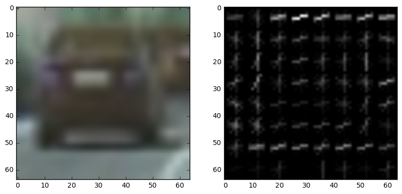
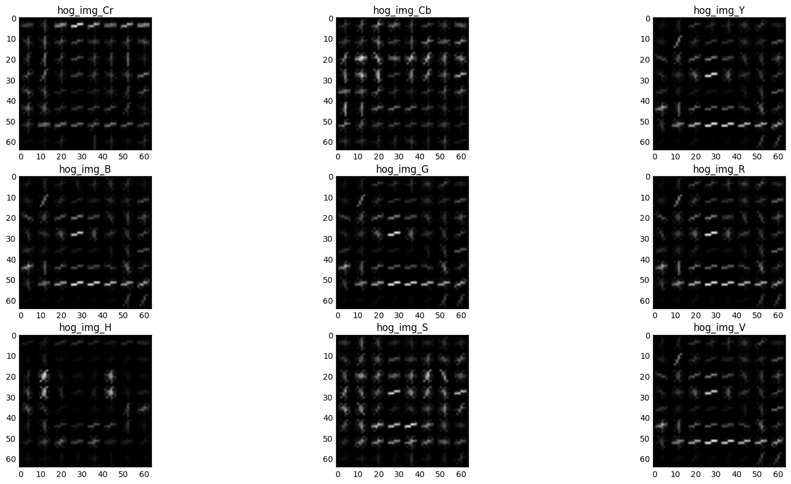
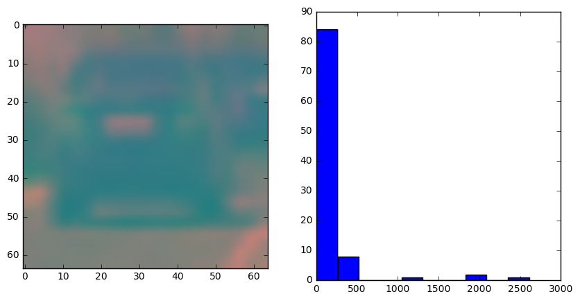
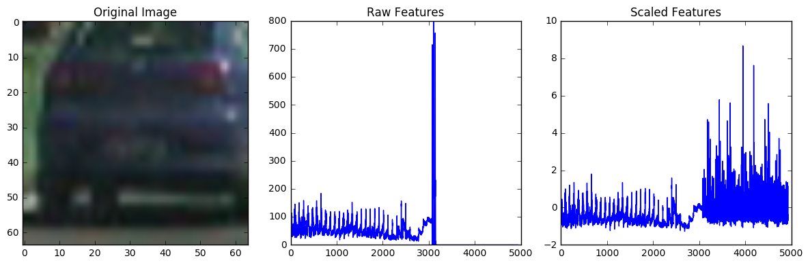
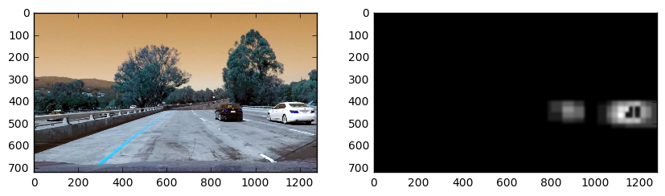
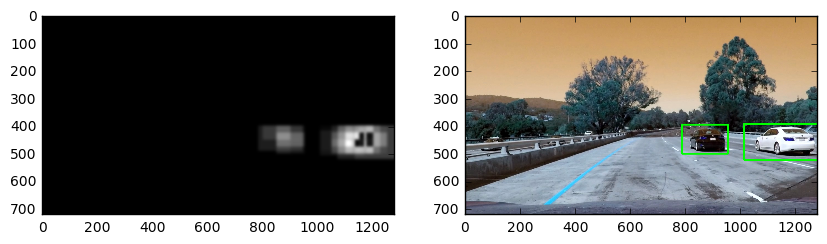
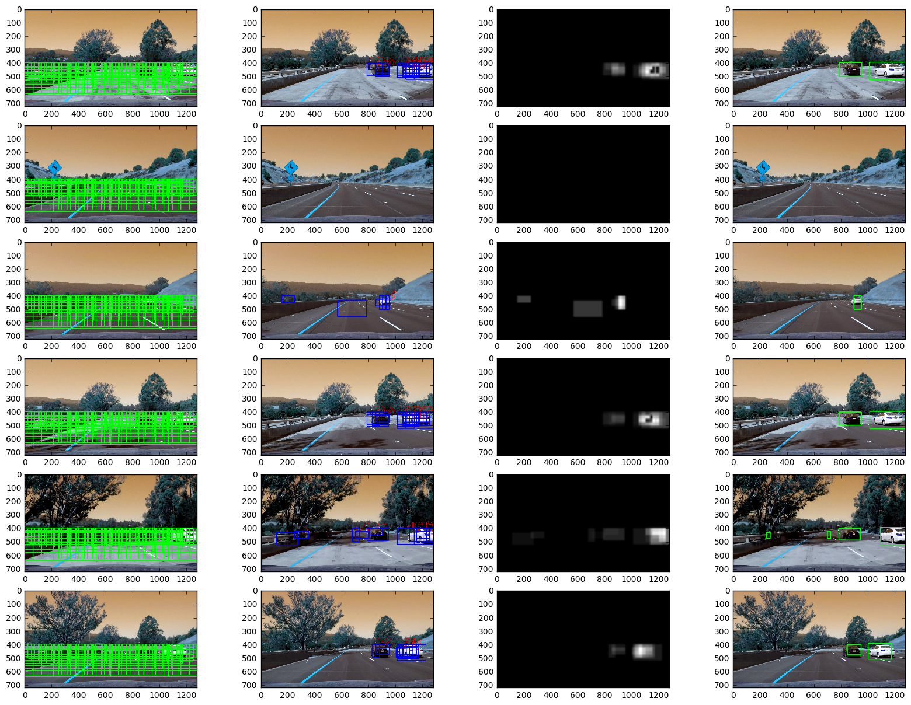

## Writeup

**P5 - Vehicle Detection Project**


The goals / steps of this project are the following:

* Perform a Histogram of Oriented Gradients (HOG) feature extraction on a labeled training set of images and train a classifier Linear SVM classifier
* Optionally, you can also apply a color transform and append binned color features, as well as histograms of color, to your HOG feature vector. 
* Note: for those first two steps don't forget to normalize your features and randomize a selection for training and testing.
* Implement a sliding-window technique and use your trained classifier to search for vehicles in images.
* Run your pipeline on a video stream and create a heat map of recurring detections frame by frame to reject outliers and follow detected vehicles.
* Estimate a bounding box for vehicles detected.

## [Rubric](https://review.udacity.com/#!/rubrics/513/view) Points
### Here I will consider the rubric points individually and describe how I addressed each point in my implementation. 

### Writeup / README

#### 1. Provide a Writeup / README that includes all the rubric points and how you addressed each one.  You can submit your writeup as markdown or pdf.  [Here](https://github.com/udacity/CarND-Vehicle-Detection/blob/master/writeup_template.md) is a template writeup for this project you can use as a guide and a starting point.  

This is the file you are currently reading!

### Histogram of Gradients

**1. Explain how (and identify where in your code) you extracted HOG features from the training images.**

**AND**

**2. Explain how you settled on your final choice of HOG parameters.**

The Extraction is done in the function 5. cell of the provided IPython Notebook

After reading in the images of vehicles and non-vehicle data I started first with the creating the spatial binning and the color histogram function. Then I applied the HOG-Transformation by using the skimage.hog function. Taking into consideration that the images are all 64x64 an 9 orientation buckets combined with 2 cells per block and 8 pixels per cell was the tradeoff between computational efficiency and precision. The number of features returned by the hog transformation are 7*7*2*2*9 = 1764! 


**Transformation Example using YCbCr with a vehicle image**



Furthermore since I was already fixed on the parameters for the HOG transformation, I was starting changing color channels to see if there is a better detection on specific color spaces: 


They were all slightly different, but on the first sight, I could not decide which one would be the best. 
I decided to go for the Cromium channel of YCbCr converted images, since it is good for different lightning conditions and for [shadow separations](https://www.researchgate.net/publication/263662695_Shadow_Detection_and_Removal_Based_on_YCbCr_Color_Space) since a cars shadow could have almost the same shape as the original car.

#### 3. Describe how (and identify where in your code) you trained a classifier using your selected HOG features (and color features if you used them).

I trained a linear Support Vector Machine Classifier using sklearn on the HOG features, a spatial binning on a resized 32x32 image as well as a color histogram of the images.

**SPATIAL BIN**

**COLOR HISTOGRAM**


Afterwards I normalized the features with the sklearn `Standardscaler` function. Furthermore, I splitted the images into training and testing dataset with a split 80/20.
An example of the feature transformation and the normalization can be seen in the following picture: 



Out of the Box, the `LinearSVC` classifier worked well, with 100% score on the training dataset and 98,2% on the testing dataset. Even if the classifier shows signs of overfitting (*everything* is classified correctly) I presumed because of the good test results.  

- The classifier can be found in code cell 11
- The training and testing split can be found in cell 10
- the whole feature extraction process can be found in cell 09


### Sliding Window Search

#### 1. Describe how (and identify where in your code) you implemented a sliding window search.  How did you decide what scales to search and how much to overlap windows?

My Sliding window function was in the end a result of trial and error.
I started with only taking the everything from y=400 into consideration (max(y)=720).

Then I settled on 6 different window sizes. 4 of them are based on the x-size of the image and two are hardcoded windows. The two hardcoded sliding windows were introduced to cover some additional spots, which were missed by the original variable sliding windows. 

The windows are defined as follows

```python
windows_small_1 = slide_window(image, x_start_stop=[None, None], y_start_stop=[400, 540], 
                    xy_window=(50, 100), xy_overlap=overlap_large)


windows_small_3 = slide_window(image, x_start_stop=[None, None], y_start_stop=[400, 540], 
                    xy_window=(100, 50), xy_overlap=overlap_large)

windows_small_2 = slide_window(image, x_start_stop=[None, None], y_start_stop=[400, 500], 
                    xy_window=(x_size//8, y_size//8), xy_overlap=overlap_small)

windows_mid_2 = slide_window(image, x_start_stop=[None, None], y_start_stop=[400, 600], 
                    xy_window=(x_size//6, y_size//6), xy_overlap=overlap_mid)

windows_medium = slide_window(image, x_start_stop=[None, None], y_start_stop=[400, 600], 
                    xy_window=(x_size//4, y_size//4), xy_overlap=overlap_medium)

windows_large = slide_window(image, x_start_stop=[None, None], y_start_stop=[400, 720], 
                    xy_window=(x_size//3, y_size//3), xy_overlap=overlap_large)

windows =windows_small_2 + windows_mid_2 + windows_large + windows_medium + windows_small_3 + windows_small_1
```

I took 4 different overlapping options to handle different image sizes. Please see the different overlap sizes on the next picture:

```python
overlap_small = (0.3,.8)
overlap_mid = (0.7,.7)
overlap_large = (.5,.5)
overlap_medium = (0.6,0.6)
```


I decided on an 30% x-overlap and 80% overlap for the small windows. This was detecting vehicles that already a bit farther away from the driving car. Still I had problems detecting far cars, the solution to that was to create a hardcoded vertical sliding window, which discovered the those cars better.
As said, the setting of the sliding window overlap were trial and error on the test images. 


*the blue color rectangles are the car detections and the red number above is the confidence of the decision_function. Every detecion that has a lower decision_function value then .6 is excluded*

### 2. Show some examples of test images to demonstrate how your pipeline is working. What did you do to try to minimize false positives and reliably detect cars?

The pipeline works as follows:

1. read in the image
2. get all sliding window coordinates
3. resize sliding window images to 64x64 for the classifer
4. Extract features as described in the Histogram of Gradients section
5. Run the classifier on the features
6. if the decision_function is higher than 0.6 we append this rectangle to the identified vehicle array

7. We create a heatmap by creating a black image and setting the area of the identified vehicle 10 * confidence of the density_function in brightness. For very confident predictions the heatmap will be brighter at that spot than for lower confident predictions. Also, if a car is detected from another sliding window on the same spot, it will increase the brightness even futher.



8. From the Heatmap we only take pixels which are brighter than 19. I chose 19 because the car has to be detected at least twice with a density_function value of 1 or the confidence of the prediction has to be higher, so that it is around 2. 
9. I apply the `cv2.findContours` function to find contours, with the option to take only external rectangles `cv2.RETR_EXTERNAL` and a simple approximation of the 4 corner points `cv2.CHAIN_APPROX_SIMPLE` 
10. I applied the `cv2.boundingRect` function to calculate the coordinates of the rectangle and draw them on the picture. 



## Whole Transformation in Pictures



### Video Implementation

#### 1. Provide a link to your final video output.  Your pipeline should perform reasonably well on the entire project video (somewhat wobbly or unstable bounding boxes are ok as long as you are identifying the vehicles most of the time with minimal false positives.)
Here's the [link to my video result](./project_modified.mp4)


#### 2. Describe how (and identify where in your code) you implemented some kind of filter for false positives and some method for combining overlapping bounding boxes.

In order to filter false positives I only take 5% of the new frame and combine it with 95% of the last frame results. So it has an influence 1/20, and I, therefore, build a moving average of the last 20 frames, which seem to work okay with false positives. 
The finding Contours combined with the heatmap also provides a good job on the detection of cars that are close to each other. Although there is a problem when the cars are overlapping. 

### Discussion

#### 1. Briefly discuss any problems / issues you faced in your implementation of this project.  Where will your pipeline likely fail?  What could you do to make it more robust?

##### About the Project
This project seemed to be easy at first because we covered the sliding window functions as well as the classifiers and hog features in the provided lessons. I struggled with the false positives, so I invested more time in tuning my parameter input. I went from using the standard RGB color to the suggested YCrCb color scheme, which was much more stable with lightning conditions and also took a look at my color histogram which was giving strange results. This was because the mpimg reads the image not with 0-255 range, but with 0-1. I switched to the cv2.imread function then. 

For the detection, I found good results using a custom threshold heat map which not only takes into account the confidence of the prediction but also how often a car was found in the image patch. The heat map was then used for the contour finding of cv2.
To deal with false positives, I only take 5% of the new image and combine it with 95% of the last frame results. So it has an influence 1/20, and I, therefore, build a moving average of the last 20 frames. 

In total, I am very proud of my project, simply because I build this without any input from the forums or the slack channel. 

##### Limitations

- I still have some false positives; this could be handled with additional windows and also fine tuning the thresholds for the heat map.
- In case the cars drive close to each other my vehicle detection algorithm draws one rectangle on both cars, which is wrong. Although, once they are not close anymore it does split fine.
